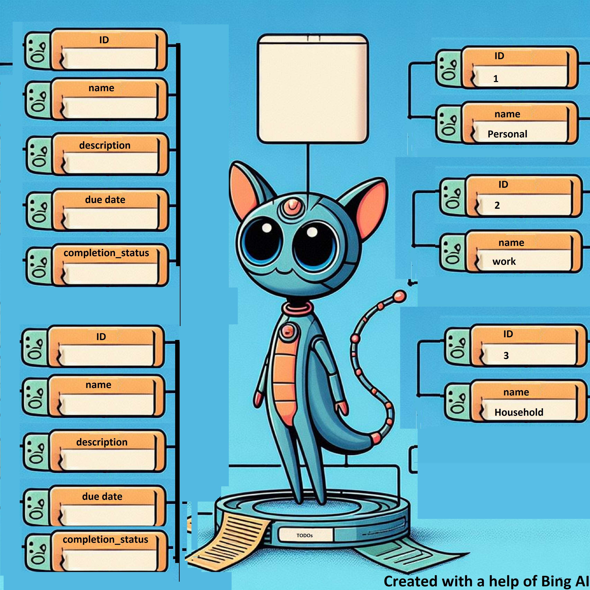

# Project summary
 
## Product Description.
### Brief overview
We are going to create a to do application. It will help manage our daily tasks, which can be categorised into groups such as Personal, Work, or Household.
Therefore, our to do app will have the following components:
Tasks: Each task has a name, description, due date, and a completion status (yes or no).
Labels: There can be Personal, Work, Household label.
Relationship: Each task can be associated with one or more labels, indicating the context or category of the task. This is a one-to-many relationship from tasks to labels.

### Functionality
1. Task Management:Create, read, update, and delete (CRUD) tasks.
2. Label Management:Create, read, update, and delete (CRUD) label.
3. Search task by a label
4. Search task by a name
5. List all labels.
6. List all tasks.
7. Maybe filtering tasks by their labels [ Depends on my mood]

### Api endpoints for tasks and labels:

These  can be access by accessing [OpenAPI definition](http://localhost:8091/swagger-ui/index.html)

## Team Description.
[Elaborate on the target audience of your project/product, link out to additional resources]
## Tools used.
### For the Backend 
- Programming language Java version 19
- Framework: Spring Boot
- Build Tool: Maven
- Database: H2 (file based)

The choice of Java 19, Spring Boot, and Maven for my backend development is primarily driven by my familiarity with these tools. These technologies are well-established in the industry, offering robust features and extensive community support, making them a reliable choice for building efficient and scalable applications.  Spring Boot provides a simplified approach to developing, allowing for rapid prototyping and development. Maven, a powerful project management tool, helps build and manage any Java-based project, ensuring consistency in project builds.

### For the frontend
[tbw]
## Instructions on how to run your application.
__Requirements to be able to run the app:__
1. java version 17
2. Apache Maven 3.3 or above
3. h2 database:username:MARCIN pass:MARCIN1 [TO MANAGE DATABASE](http://localhost:8091/h2-console)

The Spring boot backend service can be run with the following command :
`mvn compile exec:java`
to stop the service : ctrl+C

## Test Methodologies and Tools.

## Coding Best Practices.
Coding best practices are a set of guidelines designed to improve the quality of software development
and make the code more maintainable, scalable, and readable.
Therefore we use tool Checkstyle, which will help achieve the following:

### Consistent Naming Conventions: 
This makes the code easier to read and understand. 
It includes using clear descriptive names for variable, functions, and classes, etc.

### Code Formatting and Organization:
This includes proper indentation, spacing and grouping of code. 
Tools like linters and formatters can help enforce these rules.

### Commenting and Documentation: 
Comments should explain why certain decisions were made in the code. 
Documentation should explain what the code does, how to use it, and any dependencies it has.

### Error Handling: 
This involves anticipating potential problems and handling them gracefully, 
often through the use of try/catch blocks or returning meaningful error messages.

Checkstyle is a development tool that helps code adhere to the above  standards. 
It has been included and configured in the Maven dependencies to automatically check
for style issues during the build process. If the code does not adhere to the specified rules, 
the build will fail.
The rules -- which were written by Google-- are described in xml file.
This ensures that all code meets the team’s agreed-upon standards before
it is deployed, making Checkstyle a valuable tool for maintaining code quality in a project.

## CI Pipeline

## Standards

## Performance and Accessibility audit.

## Critically analyse the results.

