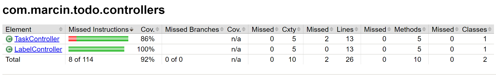

# Project summary
 
## Product Description.
### Brief overview
We are going to create a to-do application.
It will help manage our daily tasks, which can be categorised into groups such as Personal, Work or Household.
Therefore, our to-do app will have the following components:
Tasks: Each task has a name, description,  and a completion status (yes or no).
Labels: There can be Personal, Work, Household label.
Relationship: Each task must be associated with one only  label, indicating the context or category of the task.
This is a one-to-many relationship from tasks to labels.
The same label can have zero or more tasks. 

### Functionality
1. Task Management:Create, read, update, and delete (CRUD) tasks.
2. Label Management:Create, read, update, and delete (CRUD) label.
3. Search task by a label
4. Search task by a name
5. List all labels.
6. List all tasks.
7. User will be able to mark a task as completed.

### Requirements
1. Label names must be unique. If a user attempts to create a label with a name that already exists, the creation process will fail. The user will then receive an error message indicating that the chosen label name is already in use
2. A label can be created independently and is not required to be associated with any task.
3. However, each task must be associated with an existing label. A task cannot be created with a non-existent label.
4. When creating a task, providing a description is optional. However, a name is mandatory. 
   If a name is not provided, the task creation process will not proceed, and an error message will be displayed 
   to inform the user about the necessity of providing a name.
5. Upon creation, the ‘completion_status’ field of a task is always set to false, indicating that the task is not yet completed.
   This ensures that every new task starts in an incomplete state.

### Error Handling and Messages

 
| Error                                   | When it occurs                                                                        | Message to display                                                                               | Implication                                                                                                                              |
|-----------------------------------------|---------------------------------------------------------------------------------------|--------------------------------------------------------------------------------------------------|------------------------------------------------------------------------------------------------------------------------------------------|
| Task creation without a name            | When a user tries to create a task without providing a name.                          | "Task creation failed: A name is required for each task."                                        | The task will not be created until a name is provided. This ensures that all tasks can be properly identified.                           |
| Label creation with a duplicate name    | When a user tries to create a label with a name that already exists.                  | "Label creation failed: The name you've chosen is already in use. Please choose a unique name."  | The label will not be created until a unique name is provided. This ensures that all labels can be uniquely identified.                  |
| Task creation with a non-existent label | When a user tries to create a task with a label that doesn't exist.                   | "Task creation failed: The label you've chosen does not exist. Please choose an existing label." | The task will not be created until an existing label is chosen. This ensures that all tasks are associated with valid labels.            |
| Unknown error                           | When an unexpected error occurs that doesn't match any of the known error conditions. | "An unknown error occurred. Please try again."                                                   | The operation failed due to an unexpected issue. The user is advised to try the operation again or contact support if the error persists |

### Api endpoints for tasks and labels:

These  can be access by accessing [OpenAPI definition](http://localhost:8091/swagger-ui/index.html)

## Team Description.
[Elaborate on the target audience of your project/product, link out to additional resources]
## Tools used.
### For the Backend 
- Programming language Java version 19
- Framework: Spring Boot
- Build Tool: Maven
- Database: H2 (file based)

The choice of Java 19, Spring Boot, and Maven for my backend development is primarily driven by my familiarity with these tools.
These technologies are well-established in the industry, offering robust features and extensive community support, 
making them a reliable choice for building efficient and scalable applications. Spring Boot provides a simplified approach to developing,
allowing for rapid prototyping and development. Maven, a powerful project management tool, helps build and manage any Java-based project, ensuring consistency in project builds.

## Instructions on how to run your application.
__Requirements to be able to run the app:__
1. java version 17
2. Apache Maven 3.3 or above
3. h2 database 

The Spring boot backend service can be run with the following command :
`mvn compile exec:java`
to stop the service : ctrl+C

## Test Methodologies and Tools.

During the construction of my Spring Boot application, a diverse range of testing methodologies and instruments were implemented 
to ensure compliance to the specifications. Below is a detailed explanation:

### Unit Testing
For unit tests, **Mockito** was employed, enabling the mocking of dependencies of the classes under test. 
This allowed for the individual testing of each aspect of the application, affirming that they functioned as anticipated independently.

### Slice Testing
**DataJpa tests** were employed, a form of slice testing, allowing for the fast and efficient examination
of the logic behind my entities and database schemas. This offered validation of my data access layer's accuracy without 
the necessity to load the complete Spring context.

### Integration Testing
Integration tests were carried out to affirm the  interaction among different components of the application. 

### Testing Different Components
- **Controllers:** Both `LabelController` and `TaskController` were subject to unit testing using **mockMvc**. This confirmed the operational correctness of the web layer in the application.
- **Service Classes:** The service classes logic was tested exhaustively to ensure the business operations were implemented correctly.
- **Repository and Entities:** The logic of the created entities and database schemas were quickly tested using **DataJpa tests**.

An unconventional approach to testing was applied in this project.
Initially, a Minimum Viable Product (MVP) was quickly developed without unit tests to assess 
the appropriateness of Spring Boot for this project.
Post MVP establishment, the more specific  requirements  and test scenarios were defined, 
commencing unit testing from the repository layer. 
This allowed for quick validation of the technology stack and then the construction of a solid base
accompanied by comprehensive tests.

### Issues Encountered
During the testing process, I encountered several issues that required modifications to the database schema, 
entities, service layer, and controllers. Here are some examples:

**Deleting Non-Existent Labels:** The system was initially configured to quietly ignore attempts to delete
non-existent labels.
To address this, I introduced logic in the controller to check if a label exists before deletion. 
If the label doesn’t exist, the system sends a JSON message to the client informing them of the issue.

**Handling Entity IDs:** The system was initially encountering an exception when attempting 
to save an entity with a pre-existing ID. As per your requirements, 
the system should update the entity if the ID is already present,
and create a new one if it isn't.

To facilitate this, I modified the ID generation strategy from automatic to 
`GenerationType.IDENTITY`. However, the system continues to throw an exception and 
sends an appropriate message when a non-existent entity ID is provided.

In such a scenario, the system is unable to update the entity as the ID provided 
does not exist. Additionally, the system will not create a new entity because an ID was
provided. Consequently, an exception is thrown.

**Bidirectional References:** I  wanted to enable bidirectional references,
allowing  to access a label from a task and vice versa. 
However, this led to circular dependencies, which I resolved by introducing the 
EqualsAndHashCode(name) annotation. 
This forces Spring Boot to use the hashcode of the entity name when comparing entities 
of the same type..
All these issues surfaced during the unit testing of the components, emphasizing 
the importance of thorough testing in software development.

### Automation

GitHub Actions is a feature of GitHub that allows  to automate workflows for  projects.
GitHub Actions  performs tasks such as building, testing, deploying, and releasing the code.
In my example, I have a YAML file ( maven.yml in the .github folder ) that defines a workflow for a Maven project. 
The workflow consists of three jobs that run on every push and pull request to the main branch.
work flow.png

The first job is called build, and it uses the Maven wrapper to compile the java code, 
download all dependencies and run the tests.
The second job is called build2, and it uses the Jacoco GitHub Action
to generate a JaCoCo coverage report for the project. It prints the overall coverage and the coverage of all changed files
to the github pull request page.

The third job is called package, and it creates a Maven package of the todo spring boot 
application. This package is then uploaded to GitHub Packages, which is a repository
service that allows to host and share packages with other users.

One of the advantages of using GitHub Actions is that it can integrate  workflows 
with other GitHub features, such as issues, pull requests, and code reviews.

Github action  is a continuous integration (CI) process,  my example  helps ensure that code changes do not significantly decrease test coverage. 

If the coverage falls below the specified thresholds, the workflow will fail, alerting  to potential issues with the changes.

At first, I  wondered why I needed GitHub Actions if I already use Maven, which is a tool that automates the build process for Java projects. 
I noticed that   GitHub Actions and Maven complement each other, rather than replace each other. Maven handles the details of building, testing, and packaging my code,
while GitHub Actions handles the details of running, managing, and integrating my workflows with GitHub.
Together, they provide a powerful and flexible solution for automating the software development lifecycle.

In addition to the three jobs that I have defined in my YAML file, I   also created another job that generates a test coverage report for my  project.
Test coverage is a measure of how well my tests cover my  code. A high test coverage indicates that my code is well-tested and less likely to contain bugs or errors. 
A low test coverage indicates that your code is poorly-tested and more likely to contain bugs or errors.

I use the JaCoCo Maven plugin, which is a tool that measures and reports the code coverage of Java projects. I configured the JaCoCo plugin in my pom.xml file,
and then I  run the `mvn verify` command to generate the report. The report will be saved in the target/site/jacoco directory.

The  test coverage report  identifies gaps which still exist and need some work.
*detail report available from todo/target/site/jacoco/com/marcin/todo*
Total: The total coverage for the project is 75% with 154 missed instructions out of 617. 
The branch coverage is 53% with 14 missed branches out of 30.
There are 22 missed complexities, 18 missed lines, 12 missed methods, and no missed classes.

*detail report available from todo/target/site/jacoco/com/marcin/todo*
*detail report available from todo/target/site/jacoco/com/marcin/todo*
*detail report available from todo/target/site/jacoco/com/marcin/todo*
*detail report available from todo/target/site/jacoco/com/marcin/todo*

*aggregate report available from todo/target/surefire-reports*

### Test  scenarios 

| Integration | Unit |     |                                                                                                                                                                                                                  |
|-------------|------|-----|------------------------------------------------------------------------------------------------------------------------------------------------------------------------------------------------------------------|
|             |      | 1   | **Configuration tests**                                                                                                                                                                                          |
| []          | []   | 1.1 | Test the Existence of the Database: Verify that the database is correctly set up and can be accessed.                                                                                                            |
|             |      |     |                                                                                                                                                                                                                  |
| []          | [x]  | 2   | **CRUD Operations on Labels: Test scenarios related to creating, reading, updating, and deleting labels. It also includes tests for specific label-related behaviors.**                                          |
| []          | [x]  | 2.1 | Find All Labels: Verify that the repository correctly retrieves all labels.                                                                                                                                      |
| []          | [x]  | 2.2 | Save a Label: Verify that the repository correctly saves a new label.                                                                                                                                            |
| []          | [x]  | 2.3 | Find Label by ID: Verify that the repository correctly retrieves a label by its ID.                                                                                                                              |
| []          | [x]  | 2.4 | Delete a Label: Verify that the repository correctly deletes a label.                                                                                                                                            |
| []          | [x]  | 2.5 | Update Label When ID Exists: Verify that when a label is created with an ID that already exists, the existing label is updated (its name changed) and the total count of labels remains the same                 |
| []          | [x]  | 2.6 | Find Label by Name: Verify that the repository correctly retrieves a label by its name.                                                                                                                          |
|             |      |     |                                                                                                                                                                                                                  |
|             |      | 3   | **CRUD Operations on Tasks:  This section includes test scenarios related to creating, reading, updating, and deleting tasks. It also includes tests for specific task-related behaviors.**                      |    
| []          | [x]  | 3.1 | Find Task by ID: Verify that the repository correctly retrieves a task by its ID.                                                                                                                                |
| []          | [x]  | 3.2 | New Task Has Completion Set to False: Verify that when a new task is created, its completion status is correctly set to false.                                                                                   |
| []          | [x]  | 3.3 | Update Task When ID Exists: Verify that when a task is created with an ID that already exists, the existing task is updated and the total count of tasks remains the same.                                       |
| []          | [x]  | 3.4 | Update Task Name: Verify that when a task’s name is updated, the change is correctly saved in the database.                                                                                                      |
| []          | [x]  | 3.5 | Update Task Completion Status: Verify that when a task’s completion status is updated, the change is correctly saved in the database.                                                                            |
| []          | [x]  | 3.6 | Find All Tasks: Verify that the repository correctly retrieves all records from Task Table.                                                                                                                      |
| []          | [x]  | 3.7 | Find Task by Name: Verify that the repository correctly retrieves a task by its name.                                                                                                                            |
|             |      |     |                                                                                                                                                                                                                  |
|             |      | 4   | **Relationship Between Labels and Tasks: This section includes test scenarios that verify the correct behavior of relationships between labels and tasks.**                                                      |         
| []          | [x]  | 4.1 | Verify that a new task can be created  and saved.                                                                                                                                                                |
| []          | [x]  | 4.2 | Delete Tasks When Label is Deleted: Verify that when a label is deleted, all its associated tasks are also deleted.                                                                                              |
| []          | [x]  | 4.3 | Task References Its Label: Verify that when a task is retrieved by its ID, it correctly references its associated label.                                                                                         |
| []          | [x]  | 4.4 | Label Not Deleted When All Tasks Are Deleted: Verify that when all tasks of a label are deleted, the label itself is not deleted.                                                                                |
| []          | [x]  | 4.5 | Find Tasks by Label: Verify that the repository correctly retrieves all tasks associated with a specific label.                                                                                                  |
|             |      |     |                                                                                                                                                                                                                  |
|             |      | 5   | **Exception Handling: This section includes test scenarios that verify the application correctly handles exceptions.**                                                                                           |                                                                                               |             
| []          | --   | 5.1 | Raise Exception When Deleting Non-Existing Label: Verify that the repository correctly raises an exception when trying to delete a non-existing label.                                                           |                                                       
| []          | --   | 5.2 | Raise Exception When Deleting Non-Existing Task: Verify that the repository correctly raises an exception when trying to delete a non-existing task.                                                             |                                                         
| []          | []   | 5.3 | Raise Exception When Creating Label Without Name: Verify that the repository correctly raises an exception when trying to create a label without providing a name  or empty name field.                          |                                         
| []          | []   | 5.4 | Raise Exception When Creating Label With Non-Existing ID: Verify that the repository correctly raises an exception when trying to create a label with an ID that doesn't exist (since the ID is auto-generated). || []          | []   | 5.6  | Raise Exception When Creating Task With Non-Existing ID: Verify that the repository correctly raises an exception when trying to create a task with an ID that doesn't exist (since the ID is auto-generated).   || []          | []   | 5.7  | Raise Exception When Creating Label With Non-Unique Name: Verify that the repository correctly raises an exception when trying to create a label with a name that is not unique.                                 |
| []          | []   | 5.5 | Raise Exception When Updating Non-Existing Label: Verify that the repository correctly raises an exception when trying to update a non-existing label.                                                           |
| []          | []   | 5.6 | Raise Exception When Updating Non-Existing Task: Verify that the repository correctly raises an exception when trying to update a non-existing task.                                                             |
| []          | []   | 5.7 | Reject Task Creation for Non-Existing Label: Verify that the repository correctly rejects the creation of a task for a non-existing label.                                                                       |
               

## Coding Best Practices.
Coding best practices are a set of guidelines designed to improve the quality of software development
and make the code more maintainable, scalable, and readable.
Therefore, we use tool Checkstyle, which will help achieve the following:

Checkstyle is a development tool that helps code adhere to the common coding standards. 
It has been included and configured in the Maven dependencies to automatically check
for style issues during the build process. If the code does not adhere to the specified rules, 
the build will fail.
The rules -- which were written by Google-- are described in xml file.
This ensures that all code meets the team’s agreed-upon standards before
it is deployed, making Checkstyle a valuable tool for maintaining code quality in a project.

Here are some of the best coding practices that I can achieve with Checkstyle:

- **Consistent Formatting**: Checkstyle ensures that my code has consistent formatting, including indentation, line lengths,
and whitespace usage. This makes my code easier to read and understand.

- **Naming Conventions**: Checkstyle checks that my classes, methods, and variables are named according to the conventions
I have defined. This helps me and others understand what each class, method, or variable is for.

- **Code Complexity**: Checkstyle can calculate and report on various complexity metrics of my code,
such as cyclomatic complexity. This helps me identify complex code that may be hard to understand or maintain.

How Checkstyle works:

Checkstyle works by analysing Java source code files and applying a set of coding rules (checks) to each file.
These checks can be configured according to my preferences or preferences of the team because the common rules can be shared with 
the xlm file. When Checkstyle finds a line of code that violates
one of these rules, it reports the violation. In IntelliJ IDEA, these violations are highlighted in the editor, 
and a list of violations is also provided. I can then go through these violations and fix them to ensure my code adheres to 
the best coding practices.

